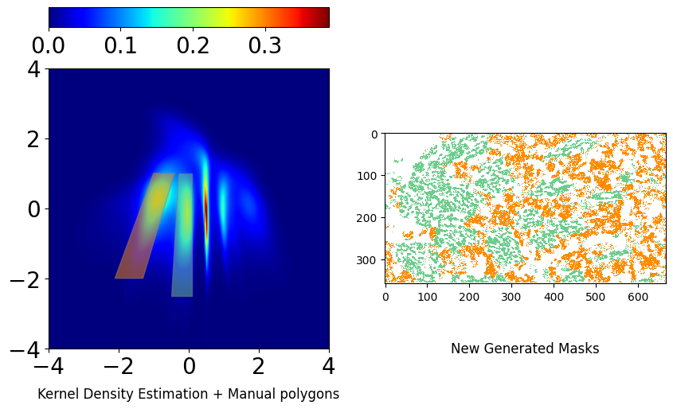
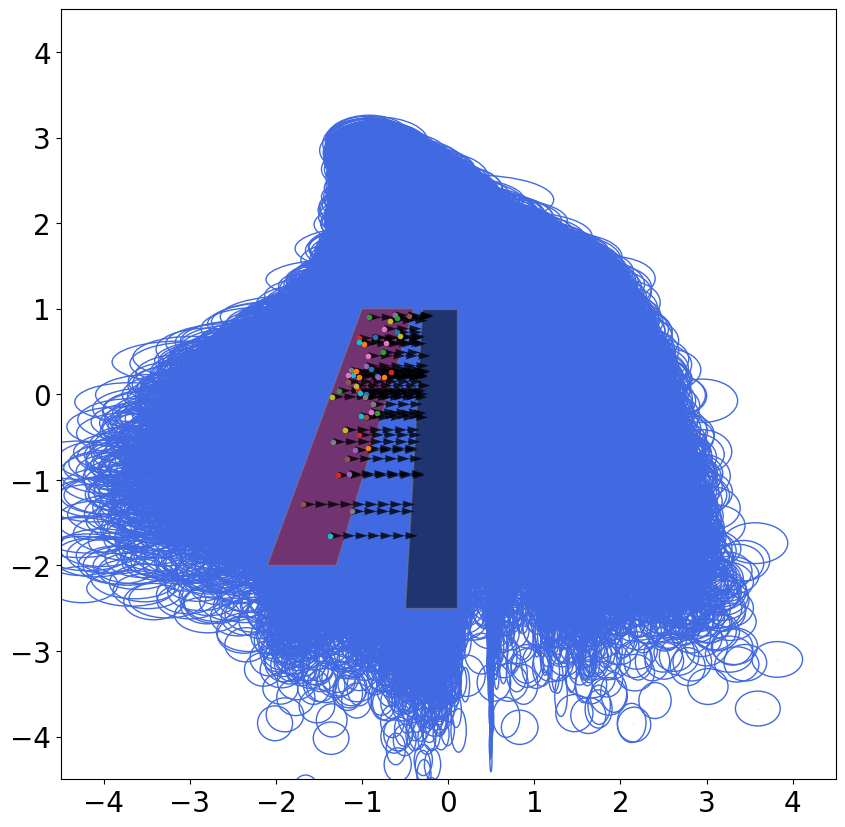
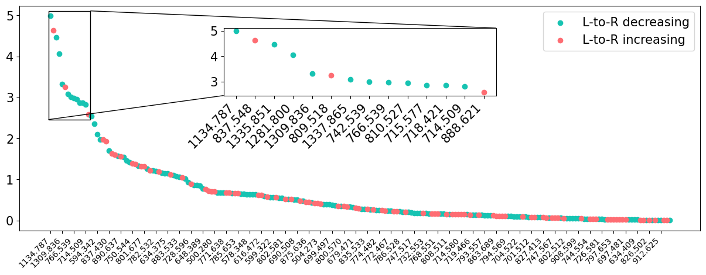

# sisal

[](https://github.com/vandeplaslab/sisal/raw/main/LICENSE)
[](https://pypi.org/project/sisal)
[](https://python.org)
[](https://github.com/vandeplaslab/sisal/actions/workflows/ci.yml)
[](https://codecov.io/gh/vandeplaslab/sisal)

The SiSAL package is an approach based on the beta-variational autoencoder and kernel density estimation
to dissect data along independent, uncertainty-aware, and interpretable (yet non-linear) latent axes. 
It includes a novel comparative-latent-traversal algorithm to
translate latent findings back into the original measurement context. 
You can find demonstrations in the /experiments folder. 
It includes an imaging mass spectrometry-based molecular imaging of human kidney and a synthetic dataset. 
The approach’s disentangling properties are shown to impose a latent space structure
that separates signal strength from relative signal content, offering exceptional
chemical insight. 

## Installing

You can install sisal from PyPI:

```bash
pip install sisal
```

or directly from source:

```bash
git clone https://github.com/vandeplaslab/sisal.git

pip install "."
```

## Examples

If you are planning on running the examples, you can install the optional dependencies with:

```bash
pip install sisal[demo]
```

This will include additional packages such as `jupyterlab` and `pooch` to download data from Zenodo.

You can find the example data on [Zenodo](https://zenodo.org/records/17910325).

## Contributing

Contributions are always welcome. Please feel free to submit PRs with new features, bug fixes, or documentation improvements.

```bash
git clone https://github.com/vandeplaslab/sisal.git

pip install -e .[dev]
```


## Figures

### Kidney imaging mass spectrometry datasets
<table>
  <tr>
    <td align="center" style="padding: 15px;">
      <br>
      <em><strong>Figure 1:</strong> Kernel density estimation of the latent space generated by the SiSAL approach together with the associated masks.</em>
    </td>
    <td align="center" style="padding: 15px;">
      <br>
      <em><strong>Figure 2 (latent traversal):</strong> Traversal example between the two highlighted regions.</em>
    </td>
    <td align="center" style="padding: 15px;">
      <br>
      <em><strong>Figure 3 (feature differentiators):</strong> The traversal algorithm extracts the most important molecular features between the two regions.</em>
    </td>
  </tr>
</table>
